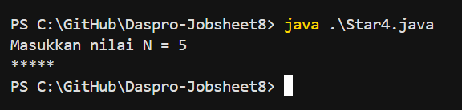
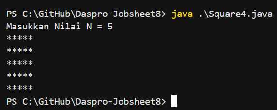

# JOBSHEET 8

# PERCOBAAN 

## - Percobaan 1 : Review Perulangan 1

## - Percobaan 1 : Verifikasi Hasil Percobaan

_Pertanyaan:_

1.  Jika pada perulangan for, inisialisasi i = 1 diubah menjadi i = 0, apa akibatnya?
Mengapa bisa demikian? 
2.  Jika pada perulangan for, kondisi i <= N diubah menjadi i > N, apa akibatnya? 
Mengapa bisa demikian? 
3.  Jika pada perulangan for, kondisi step i++ diubah menjadi i-- apa akibatnya?
Mengapa bisa demikian? 

_Jawaban:_

1.  Akibatnya   : Jumlah bintang bertambah satu.
    Alasannya   : Karena indeks perulangan dimulai dari 0, bukan 1, maka kondisi i <= N membuat loop berjalan satu kali lebih banyak.

    Contoh : Jika N = 5,
    - Dengan i = 1, Output : ***** (5 bintang)
    - Dengan i = 0, Output : ****** (6 bintang)
2.  Akibatnya   : Tidak ada bintang yang tercetak.
    Alasanya    : Kondisi i > N tidak pernah benar untuk nilai awal i = 1 dan N lebih besar darinya.
    Jadi, loop tidak dijalankan sama sekali.
3.  Akibatnya   : Terjadi perulangan tak terbatas (infinite loop).
    Alasannya   : Karena i-- membuat nilai i terus menurun, sehingga kondisi i <= N selalu benar dan loop tidak pernah selesai.

## - Percobaan 2 : Bintang Persegi

## - Percobaan 2 : Verifikasi Hasil Percobaan

_Pertanyaan:_

1.  Perhatikan perulangan luar. Jika pada sintaks for, inisialisasi iOuter = 1 diubah menjadi iOuter = 0, apa akibatnya? Mengapa bisa demikian? 
2.  Kembalikan program semula dimana inisialisasi iOuter = 1. Kemudian perhatikan perulangan dalam, Jika pada sintaks for, inisialisasi i = 1 diubah menjadi i = 0, apa akibatnya? Mengapa bisa demikian?
3.  Jadi, apakah perbedaan kegunaan antara perulangan luar dengan perulangan yang berada didalamnya? 
4.  Mengapa perlu ditambahkan sintaks System.out.println(); di bawah perulangan dalam? Apa akibatnya jika sintaks tersebut dihilangkan?
5.  Silakan commit dan push ke repository Anda.

_Jawaban:_

1.  Akibatnya   : Jumlahnya jadi N + 1 kali (karena mulai dari 0, bukan 1). Jumlah baris bintang
    bertambah satu.
    Alasannya   :
    - Perulangan dimulai dari 0 dan berhenti ketika iOuter > N.
    - Artinya perulangan berjalan 1 kali lebih banyak dibanding kalau dimulai dari 1.
2.  Akibatnya   : Setiap baris menampilkan satu bintang lebih banyak.
    Alasannya   : Karena indeks perulangan i dimulai dari 0, sehingga perulangan berjalan N + 1 kali.
3.  1. Perulangan luar
    - Fungsinya : Mengatur jumlah baris.
    - Analogi   : Berapa kali kita menggambar baris baru.
    2. Perulangan dalam 
    - Fungsinya : Mengatur isi tiap baris.
    - Analogi   : Berapa banyak bintang di dalam baris tersebut. 
    Jadi, perulangan luar = baris, dan perulangan dalam = kolom (isi baris).
4.  - Fungsi System.out.println(); adalah untuk pindah ke baris baru setelah mencetak satu baris
    bintang selesai dicetak.
    - Akibat jika baris ini dihapus, maka semua bintang akan dicetak dalam satu baris panjang tanpa baris baru.

## - Percobaan 3 : Bintang Segitiga

## - Percobaan 3 : Verifikasi Hasil Percobaan 

 
